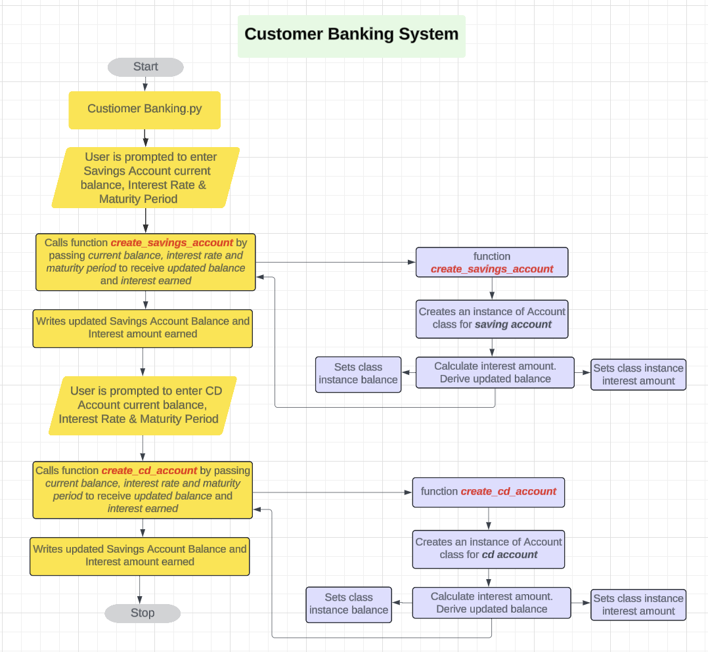
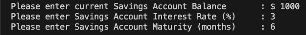
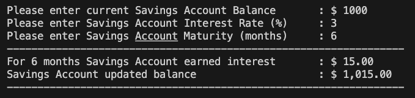
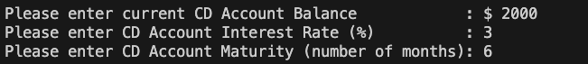
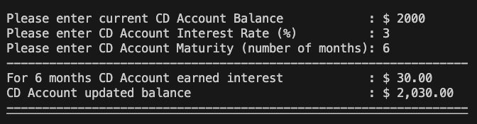

# Customer Banking System
This application program allows users to calculate and track interest earned on savings 
and CD accounts. By running this application, users will be able to enter their 
savings and CD account information, see the interest earned, and view the 
updated balances after a specified number of months.

## Technical details:
This application has following four programs - 
```python 
Accounts.py
```
This program contains ***Account*** class definition. 
    ***Account*** class has following three methods:
- ***init*** initializes the class by setting initial values for *balance* and *interest*
- ***set_balance*** method updates ***Account*** instance *balance* based on input parameter value
- ***set_interest*** method updates ***Account*** instance *interest* based on input parameter value  


```python
savings_account.py
```
This program has a function **create_savings_account**.
It receives three parameters *balance, interest_rate, months*.
It is used to create a savings account class instance, calculate interest earned, and update account balance.
It returns *new balance* and *interest amount* to the main program that calls this function.


```python
cd_account.py
```
Above program has a function **create_cd_account**
It receives three parameters *balance, interest_rate, months*.
It is used to create a CD account class instance, calculate interest earned, and update account balance.
It returns *new balance* and *interest amount* to the main program that calls this function.


```python
customer_banking.py
```
When user executes this program, it will prompt the user to input Savings and CD Account's initial
balance amount, interest rate and maturity period values. 
Then it calls functions **create_savings_account** and **create_cd_account** which will return 
interest amount and updated balance. Those values are then displayed to the user. 

## Program flowchart


## Use:
When the program is executed it will prompt the user to input Savings Account current balance, 
Savings Account interest rate (%) and Savings Account Maturity (months)



It will then display Interest earned and Savings Account updated balance



Next it will prompt the user to input CD Account current balance, 
CD Account interest rate (%) and CD Account Maturity (months)



Finally it will display Interest earned and CD Account updated balance



